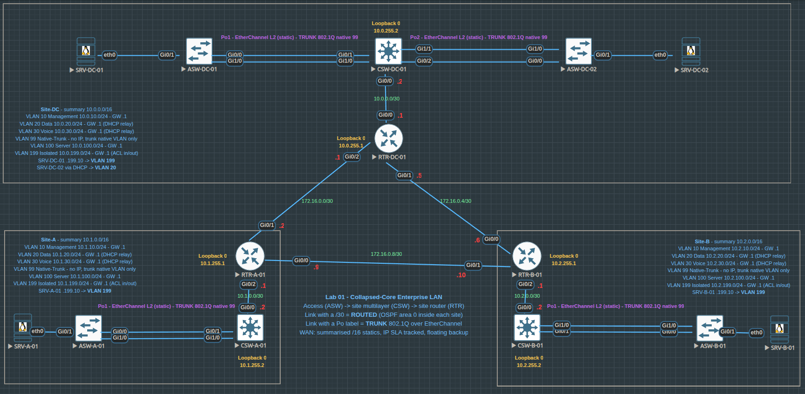

# Three-Tier Enterprise LAN Lab

## Objective

This lab simulates a three-tier enterprise LAN design using Core, Distribution, and Access layers in EVE-NG.

The goal is to practice enterprise switching, VLAN segmentation, routing, ACLs, static inter-site connectivity, and secure device management through a CCNA/CCNP-style practical exercise.

## Topology



## Lab Scenario

The network is divided into multiple sites and VLANs. Each site uses separate VLANs for management, data, servers, and isolated traffic.

The lab focuses on building a multi-site enterprise LAN design with routed uplinks, local OSPF routing, static inter-site routing, VLAN segmentation, and controlled traffic from an isolated VLAN.

## Technologies Practiced

* SSH management on routers and multilayer switches
* CDP
* VLANs and 802.1Q trunks
* VTP off mode
* Voice VLAN preparation
* Rapid-PVST
* PortFast and BPDU Guard
* Layer 3 routed ports
* OSPF Area 0 within each site
* Static inter-site routing
* Static default routes
* Extended ACL filtering

## Lab Goals

1. Build a three-tier LAN using Core, Distribution, and Access layers.
2. Segment the network using VLANs for management, data, servers, and isolated devices.
3. Configure trunk links between Access and Distribution switches.
4. Configure Rapid-PVST and define STP root priorities.
5. Use routed ports between Distribution and Core layers.
6. Advertise internal networks using OSPF Area 0.
7. Configure static routes between the site routers and static default routes from the multilayer switches toward their local routers.
   
## VLAN Summary

| VLAN | Purpose |
| --- | --- |
| VLAN 10 | Management |
| VLAN 20 | Data |
| VLAN 30 | Voice | 
| VLAN 99 | Trunk Native |
| VLAN 100 | Server VLAN — defined and routed |
| VLAN 999 | Isolated lab/test endpoints |

```
The `SRV-*` test endpoints shown in the captured verification outputs are connected to VLAN 999 and are used to test isolated-segment routing and ACL behavior.

VLAN 100 is defined and routed, but no endpoint connected to VLAN 100 is demonstrated in the captured tests. VLAN 99, not VLAN 999, is used as the native VLAN on trunk links.
```

## Routing Design

The lab uses OSPF Area 0 between the Core and Distribution layers. Routed ports are used between Layer 3 devices instead of extending VLAN trunks through the core.

This design keeps Layer 2 boundaries smaller and makes the core routing layer more scalable and stable.

## Security Features

The lab includes the following basic security practices:

* SSH-only remote access on routers and multilayer switches
* Local user authentication
* PortFast and BPDU Guard on active end-device ports
* Native VLAN 99 separated from user VLANs
* An inbound ACL on VLAN 999 restricting non-ICMP traffic toward private networks

## Configuration Files

Sanitized device configurations are stored in the `configs` folder.

- [RTR-DC-01 Configuration](configs/RTR-DC-01.txt)
- [RTR-A-01 Configuration](configs/RTR-A-01.txt)
- [RTR-B-01 Configuration](configs/RTR-B-01.txt)
- [CSW-DC-01 Configuration](configs/CSW-DC-01.txt)
- [ASW-DC-01 Configuration](configs/ASW-DC-01.txt)
- [ASW-DC-02 Configuration](configs/ASW-DC-02.txt)
- [CSW-A-01 Configuration](configs/CSW-A-01.txt)
- [ASW-A-01 Configuration](configs/ASW-A-01.txt)
- [CSW-B-01 Configuration](configs/CSW-B-01.txt)
- [ASW-B-01 Configuration](configs/ASW-B-01.txt)

## Verification

Verification commands and test results are documented in [verification.md](verification.md) file.

## Notes

This lab is for learning and documentation purposes. Passwords, hashes, serial numbers, and sensitive values were removed before publishing.
