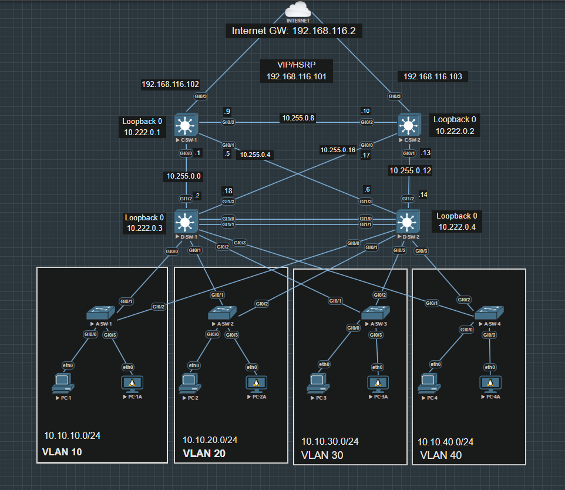

# Three-Tier Architecture Lab

## Objective

This lab builds a three-tier enterprise network (Core, Distribution, and Access layers) in EVE-NG, focusing on Layer 3 redundancy between Core and Distribution switches, HSRP for gateway redundancy, and VLAN segmentation at the Access layer.

## Topology

**Core Layer:** C-SW-1 and C-SW-2, each with a full-mesh of routed links to both Distribution switches, and an uplink toward the Internet edge with HSRP.

**Distribution Layer:** D-SW-1 and D-SW-2, redundantly connected to both Core switches and to each other, aggregating the Access layer.

**Access Layer:** A-SW-1 through A-SW-4, each dual-homed to both Distribution switches, hosting one VLAN/subnet per switch with two end devices each.

## Device Roles and IP Addressing

| Device | Layer | Loopback 0 | Notes |
|---|---|---|---|
| C-SW-1 | Core | 10.222.0.1 | HSRP real IP 192.168.116.102 toward Internet edge |
| C-SW-2 | Core | 10.222.0.2 | HSRP real IP 192.168.116.103 toward Internet edge |
| D-SW-1 | Distribution | 10.222.0.3 | Dual uplinks to C-SW-1 and C-SW-2 |
| D-SW-2 | Distribution | 10.222.0.4 | Dual uplinks to C-SW-1 and C-SW-2 |
| A-SW-1 | Access | n/a | VLAN 10 / 10.10.10.0/24 |
| A-SW-2 | Access | n/a | VLAN 20 / 10.10.20.0/24 |
| A-SW-3 | Access | n/a | VLAN 30 / 10.10.30.0/24 |
| A-SW-4 | Access | n/a | VLAN 40 / 10.10.40.0/24 |

**HSRP Virtual IP:** 192.168.116.101

**Internet Gateway:** 192.168.116.2

## VLAN Summary

| VLAN | Subnet | Access Switch |
|---|---|---|
| 10 | 10.10.10.0/24 | A-SW-1 |
| 20 | 10.10.20.0/24 | A-SW-2 |
| 30 | 10.10.30.0/24 | A-SW-3 |
| 40 | 10.10.40.0/24 | A-SW-4 |

## Redundancy Design

Core switches connect to both Distribution switches (full mesh) for Layer 3 path redundancy.

Distribution switches have a direct link to each other in addition to their Core uplinks.

Each Access switch is dual-homed to both Distribution switches.

HSRP provides first-hop gateway redundancy at the Core layer toward the Internet edge.

## Configuration Files

Not yet included. Sanitized device configurations can be added to a configs folder in a future update.

## Notes

This lab is for learning and documentation purposes. Passwords, hashes, and sensitive values will be removed before publishing any configuration files.
