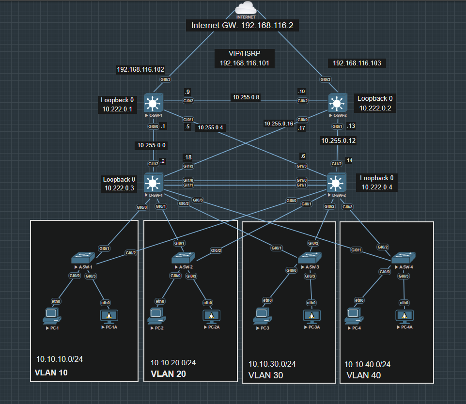

# Three-Tier Redundant Architecture Lab

## Objective

This lab documents a three-tier enterprise network built in EVE-NG using Core, Distribution, and Access layers.

The design focuses on:

- Layer 3 redundancy
- Redundant uplinks
- VLAN segmentation
- HSRP redundancy on the simulated Internet-facing segment
- OSPF dynamic routing
- High availability
- Network troubleshooting and verification

## Topology

## Network Design

### Core Layer

The Core layer contains two Layer 3 switches:

- `C-SW-1`
- `C-SW-2`

Each Core switch connects to both Distribution switches through routed Layer 3 links.

The Core switches also connect to the simulated Internet edge and use HSRP to provide gateway redundancy.

### Distribution Layer

The Distribution layer contains:

- `D-SW-1`
- `D-SW-2`

Each Distribution switch connects to both Core switches.

The Distribution switches are connected through two separate links:

- A routed Layer 3 link used by OSPF as an additional routing path.
- An 802.1Q trunk carrying VLANs 10, 20, 30, and 40.

The Layer 2 trunk allows an Access switch to reach the Distribution switch hosting its VLAN gateway when traffic enters through the alternate uplink.

The Distribution switches provide the default gateways for the user VLANs.

### Access Layer

The Access layer contains four switches:

- `A-SW-1`
- `A-SW-2`
- `A-SW-3`
- `A-SW-4`

Each Access switch is connected to both Distribution switches for redundant Layer 2 connectivity.

Each Access switch serves one user VLAN.

## Device Roles and Loopback Addresses

| Device | Layer | Loopback 0 | Role |
|---|---|---|---|
| `C-SW-1` | Core | `10.222.0.1/32` | Primary Core switch |
| `C-SW-2` | Core | `10.222.0.2/32` | Secondary Core switch |
| `D-SW-1` | Distribution | `10.222.0.3/32` | Primary Distribution switch |
| `D-SW-2` | Distribution | `10.222.0.4/32` | Secondary Distribution switch |
| `A-SW-1` | Access | N/A | Access switch for VLAN 10 |
| `A-SW-2` | Access | N/A | Access switch for VLAN 20 |
| `A-SW-3` | Access | N/A | Access switch for VLAN 30 |
| `A-SW-4` | Access | N/A | Access switch for VLAN 40 |

## VLAN and Subnet Summary

| VLAN | Subnet | Access Switch |
|---|---|---|
| VLAN 10 | `10.10.10.0/24` | `A-SW-1` |
| VLAN 20 | `10.10.20.0/24` | `A-SW-2` |
| VLAN 30 | `10.10.30.0/24` | `A-SW-3` |
| VLAN 40 | `10.10.40.0/24` | `A-SW-4` |

## Internet Edge Redundancy

In this lab, HSRP is intentionally implemented on the Core switches on the segment facing the simulated Internet node.

This is not the typical campus deployment in which HSRP provides the default gateway for end-user VLANs. The design was used as a lab-specific method to provide a shared and redundant Layer 3 address between the two Core switches and the simulated Internet segment.

| Device | IP Address |
|---|---|
| `C-SW-1` | `192.168.116.102/24` |
| `C-SW-2` | `192.168.116.103/24` |
| HSRP Virtual IP | `192.168.116.101` |
| Internet Gateway | `192.168.116.2` |

The virtual IP `192.168.116.101` represents the redundant Core-side address on the Internet-facing segment.

If the active Core switch becomes unavailable, the standby Core switch assumes ownership of the HSRP virtual IP, preserving Layer 3 availability on that segment.

The HSRP placement in this lab is intentional and reflects the requirements and limitations of the simulated topology.

## Routing Design

The network uses routed Layer 3 links between the Core and Distribution switches.

OSPF is used to advertise:

- Core loopback interfaces
- Distribution loopback interfaces
- Layer 3 transit networks
- User VLAN networks
- The default route toward the Internet edge

The routed design reduces Layer 2 failure domains and provides multiple paths between the Core and Distribution layers.

## HSRP Implementation

HSRP is implemented exclusively on the Core switches on the segment facing the simulated Internet node.

The virtual IP `192.168.116.101` provides a shared and redundant Core-side address. The simulated Internet node can use this virtual address as the next hop for routes returning toward the internal network.

HSRP is not used as the default gateway mechanism for the internal user VLANs. The VLAN gateway responsibilities are distributed between the two Distribution switches:

- `D-SW-1` provides the gateways for VLANs 10 and 30.
- `D-SW-2` provides the gateways for VLANs 20 and 40.

This placement was selected intentionally for the simulated topology and differs from the typical campus design where HSRP is commonly deployed on user VLAN interfaces.

## Redundancy Design

The lab includes:

- Two Core switches
- Two Distribution switches
- Four Access switches
- Full-mesh Layer 3 connectivity between Core and Distribution
- A routed Layer 3 link between the Distribution switches
- A separate 802.1Q trunk between the Distribution switches
- Dual uplinks from each Access switch
- HSRP gateway redundancy
- OSPF dynamic routing

The design provides alternate paths after routed-link or Access-uplink failures. HSRP also preserves the shared Core-side address if one Core switch becomes unavailable. Internal VLAN gateway redundancy is outside the scope of this implementation.

## Technologies Practiced

- Three-tier enterprise network architecture
- Cisco Layer 3 switching
- Routed switch ports
- VLAN segmentation
- 802.1Q trunking
- HSRP
- OSPF
- Loopback interfaces
- Redundant uplinks
- Default route propagation
- Network troubleshooting
- Cisco IOS verification commands

## Lab Goals

1. Build a three-tier network using Core, Distribution, and Access layers.
2. Configure Layer 3 routed links between Core and Distribution switches.
3. Establish OSPF neighbor relationships.
4. Advertise loopbacks, transit networks, and VLAN networks through OSPF.
5. Configure redundant uplinks between the Access and Distribution layers.
6. Configure HSRP toward the simulated Internet edge.
7. Verify inter-VLAN connectivity.
8. Verify end-to-end network connectivity.
9. Test link and device redundancy.

## Configuration Files

Sanitized device configurations are stored in the `configs` folder:

- [C-SW-1 Configuration](configs/C-SW-1.txt)
- [C-SW-2 Configuration](configs/C-SW-2.txt)
- [D-SW-1 Configuration](configs/D-SW-1.txt)
- [D-SW-2 Configuration](configs/D-SW-2.txt)
- [A-SW-1 Configuration](configs/A-SW-1.txt)
- [A-SW-2 Configuration](configs/A-SW-2.txt)
- [A-SW-3 Configuration](configs/A-SW-3.txt)
- [A-SW-4 Configuration](configs/A-SW-4.txt)

## Verification

Verification commands and testing methodology are documented in:

[View Verification Documentation](verification.md)

Verification areas include:

- VLAN verification
- Trunk verification
- Routed-interface verification
- OSPF neighbor verification
- Routing-table verification
- HSRP verification
- Inter-VLAN connectivity
- End-to-end connectivity
- Redundancy and failover testing

## Security and Privacy

Passwords, hashes, serial numbers, and sensitive values are removed or changed before publishing.

All addressing and network scenarios are used for lab and documentation purposes.

## Final Result

The lab demonstrates a redundant three-tier enterprise architecture using Layer 3 routing, VLAN segmentation, HSRP, OSPF, and multiple network paths.

The design provides gateway redundancy, dynamic route recovery, and resilient connectivity between the Core, Distribution, and Access layers.
