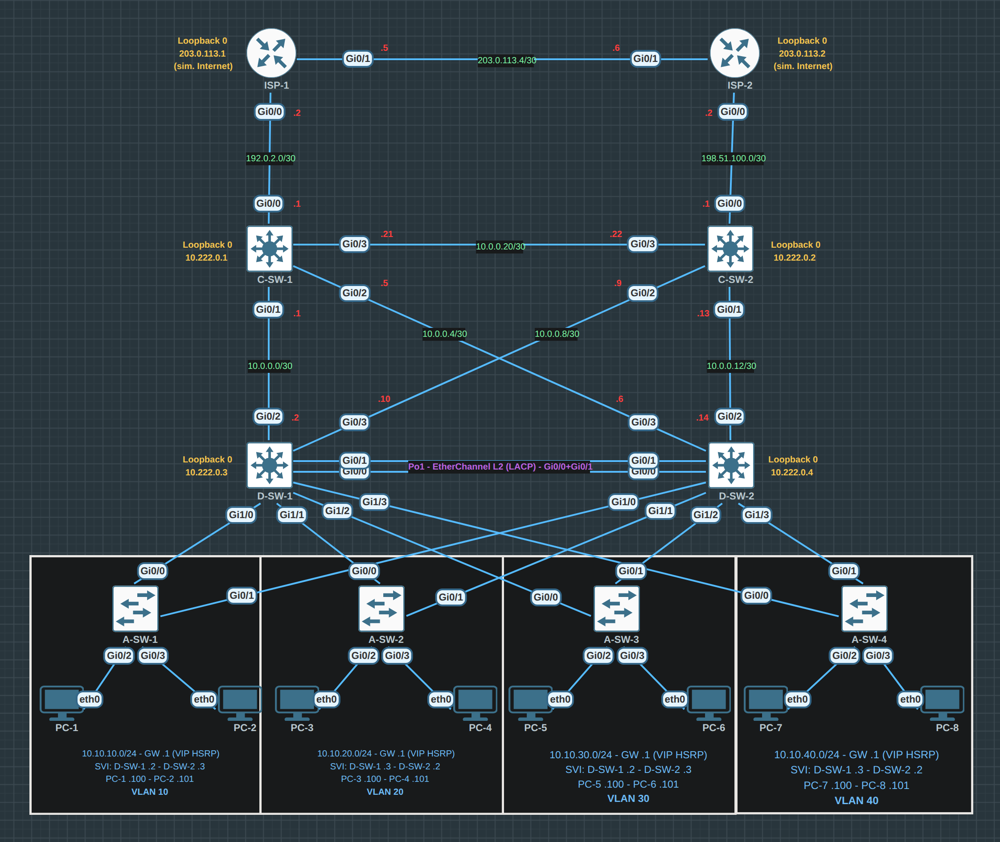

# Three-Tier Architecture with Layer 3 Redundancy

A campus network built the way a real one is: three hierarchical layers, routed
links between Core and Distribution, first-hop redundancy for the users, and two
independent Internet upstreams. Nothing in it depends on a single device.

- **Platform:** EVE-NG Community
- **Images:** `vios-adventerprisek9` (routers), `viosl2-adventerprisek9` (switches), VPCS (hosts)
- **Size:** 18 nodes, 26 links, 4 user VLANs

## Topology

## Layers

**Core — `C-SW-1`, `C-SW-2`.** Two IOSv routers. Each one faces its own ISP and
carries a routed `/30` down to *both* Distribution switches, plus a Core–Core
link (`10.0.0.20/30`) so the two halves stay connected even if a Distribution
path is lost.

**Distribution — `D-SW-1`, `D-SW-2`.** Two IOSvL2 switches. Northbound they are
routed (`no switchport` on `Gi0/2` and `Gi0/3`) and speak OSPF. Southbound they
are Layer 2 trunks toward the access switches. Between themselves they run a
pure Layer 2 EtherChannel (`Po1`, LACP over `Gi0/0` + `Gi0/1`) — no IP, no OSPF
adjacency. They own the user gateways via HSRP.

**Access — `A-SW-1` … `A-SW-4`.** One VLAN each, two hosts each, and dual uplinks
to both Distribution switches.

## Design decisions worth knowing

**OSPF 1 is multi-area, with the Core switches acting as ABRs.** `area 0` covers
the Core–Core link (`10.0.0.20/30`) and the Core loopbacks; `area 1` covers the
four Core–Distribution transits, the Distribution loopbacks and the four user
VLANs. Interfaces are placed with `ip ospf 1 area <n>` rather than `network`
statements, and the transit links run `ip ospf network point-to-point` to skip
DR/BDR election.

**Exactly five adjacencies form** — one in area 0 (C-SW-1 ↔ C-SW-2) and four in
area 1 (each Core to each Distribution). The Distribution loopbacks and the four
SVIs are `passive-interface`, so they are advertised into area 1 without
creating neighbours. `show ip ospf neighbor` returning any other count means the
design drifted.

**The ISP links stay out of OSPF** on purpose. The Internet edge is reached by
static and default routing, not by peering with a simulated ISP. Their absence
from the OSPF process is intentional, not an oversight.

**The two ISPs are linked to each other** (`203.0.113.4/30`) and each edge static
route is tied to an IP SLA probe. Both details exist for the same reason: without
them, half the Internet traffic black-holes at the wrong ISP, and a failed
upstream is never detected. See [`addressing-plan.md`](addressing-plan.md).

**The Distribution–Distribution link carries no OSPF.** It is Layer 2 only. Its
job is to let both switches see every user VLAN, which is what makes HSRP work.

**HSRP alternates its active router per VLAN** (D-SW-1 for VLANs 10 and 30,
D-SW-2 for 20 and 40) so both switches forward traffic in normal operation
instead of leaving one idle. **The spanning-tree root follows the same split**
(Rapid-PVST, priority 24576 on the VLANs a switch is HSRP-active for, 28672 on
the others), so Layer 2 forwarding and the Layer 3 gateway agree on which
Distribution switch a VLAN's traffic goes through.

**Public-facing addressing uses RFC 5737 documentation ranges**
(`192.0.2.0/24`, `198.51.100.0/24`, `203.0.113.0/24`). The lab can be imported
anywhere without colliding with a real network, and no host route ever leaks
toward something that exists.

Full addressing and the interface-by-interface map: [`addressing-plan.md`](addressing-plan.md).
Test procedure and expected output: [`verification.md`](verification.md).

## Platform notes

**`ISP-*` and `C-SW-*` are IOSv routers**, not Layer 3 switches. Their interfaces
are routed already, so `no switchport` is not a valid command on them — it is
rejected line by line and leaves the interface unconfigured. Only `D-SW-*` and
`A-SW-*` (IOSvL2) need it.

**LACP negotiated normally in this lab.** `Po1` came up as `Po1(SU)`, protocol
`LACP`, with both members `(P)`, and `show lacp neighbor` lists the partner on
each side. That is worth stating explicitly, because lab 01 in this same repo —
same EVE-NG host, same IOSvL2 image — could not get LACP to negotiate over its
links and runs its EtherChannels static. What differs between the two has not
been tracked down yet; until it is, treat LACP over EVE-NG bridges as something
to verify with `show lacp neighbor` rather than assume.

## What is in `configs/`

`configs/` holds what each device actually runs, pulled from the lab itself
and sanitised. Every device is fully configured and the lab passes the whole
of [`verification.md`](verification.md), including the failure tests.

[`configs-skeleton/`](configs-skeleton/) is the other half of the story: the
clean starting point for every device, with no protocols at all, for working
through the lab from scratch.

## Running the lab

1. Build the topology in EVE-NG from the interface map in
   [`addressing-plan.md`](addressing-plan.md): 18 nodes, 26 links. The `.unl`
   is deliberately not published — an EVE-NG export embeds every node's
   startup-config verbatim, and nothing goes into this repo that has not been
   through the sanitised `configs/`.
2. Load [`configs-skeleton/`](configs-skeleton) as the startup-configs to work
   through the lab yourself, or [`configs/`](configs) for the finished state.
   The VPCS files use VPCS syntax, not IOS.
3. Confirm both node images are present under `/opt/unetlab/addons/qemu/`.
4. Start all nodes and give the switches about two minutes to boot.
5. Work through [`verification.md`](verification.md) in order.

If a node boots with the factory hostname (`Switch>`), its startup-config was not
applied: EVE-NG only injects it into a node that boots clean. Stop that node,
**Wipe** it, and start it again.
