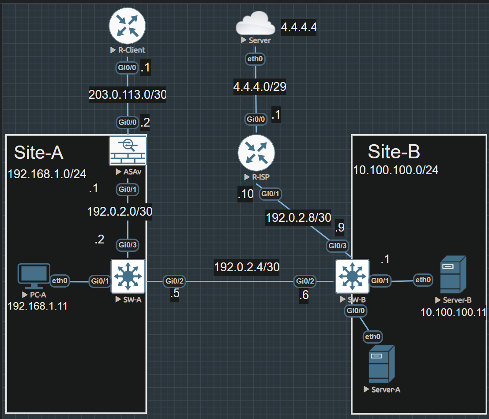

# Cisco ASA Destination NAT and ACL Lab

## Objective

This lab demonstrates how a Cisco ASA can allow an external client to reach an internal server through a fixed destination IP address, even when the server moves between two internal sites.

Clients behind `R-Client` always connect to `8.8.8.8` using ICMP, SSH, or HTTPS. The ASA translates that destination address to the current real IP address of `Server-A`.

## Business Scenario

A network engineer requested a lab example showing how the ASA configuration would operate before applying a similar design in a real environment.

The company has two internal sites:

- **Site-A:** `192.168.1.0/24`
- **Site-B:** `10.100.100.0/24`

`Server-A` can be located in either site:

- **Site-A address:** `192.168.1.10`
- **Site-B address:** `10.100.100.10`

External clients do not need to know the current real IP address of `Server-A`. They always connect to the same destination address:

```text
8.8.8.8
```

Lab note: The address 8.8.8.8 is used only as a simulated destination inside the isolated EVE-NG environment. It does not represent communication with the real public service associated with that address.

Lab Goals
- Establish connectivity between Site-A and Site-B.
- Provide both internal sites with connectivity to the external server network 4.4.4.0/29.
- Allow clients behind R-Client to reach 8.8.8.8 using ICMP, SSH, and HTTPS.
- Configure the ASA to translate traffic destined for 8.8.8.8 to the current real IP address of Server-A.
- Maintain the same external destination address when Server-A moves between sites.
- Require only the ASA SERVER_A network object to be updated when the server changes location.
- Verify routing, NAT, ACL, and end-to-end connectivity.

## Topology



## Network Summary

| Purpose | Network |
|---|---|
| Site-A LAN | 192.168.1.0/24 |
| Site-B LAN | 10.100.100.0/24 |
| ASA outside network | 203.0.113.0/30 |
| ASA inside network | 192.0.2.0/30 |
| Site-A to Site-B transit | 192.0.2.4/30 |
| Site-B to ISP transit | 192.0.2.8/30 |
| ISP server network | 4.4.4.0/29 |

## Devices

| Device | Role |
|---|---|
| R-Client | External client router |
| ASAv | Firewall between external client and internal network |
| SW-A | Site-A Layer 3 switch |
| SW-B | Site-B Layer 3 switch |
| R-ISP | ISP router |
| PC-A | Site-A client |
| Server-A | Site-B internal server |
| Server-B | Site-B internal server |
| Server | Simulated external server |

## IP Addressing

| Device | Interface | IP Address | Description |
|---|---|---|---|
| R-Client | Gi0/0 | 203.0.113.1/30 | Toward ASA outside |
| ASAv | Gi0/0 | 203.0.113.2/30 | Outside interface |
| ASAv | Gi0/1 | 192.0.2.1/30 | Inside interface |
| SW-A | Gi0/3 | 192.0.2.2/30 | Toward ASA |
| SW-A | Gi0/2 | 192.0.2.5/30 | Toward SW-B |
| SW-B | Gi0/2 | 192.0.2.6/30 | Toward SW-A |
| SW-B | Gi0/3 | 192.0.2.9/30 | Toward R-ISP |
| R-ISP | Gi0/1 | 192.0.2.10/30 | Toward SW-B |
| R-ISP | Gi0/0 | 4.4.4.1/29 | Toward external server |
| PC-A | eth0 | 192.168.1.11/24 | Site-A client |
| Server-A | eth0 | 10.100.100.10/24 | Site-B server |
| Server-A | eth0 | 192.168.1.10/24 | Site-A server |
| Server-B | eth0 | 10.100.100.11/24 | Site-B server |
| Server | eth0 | 4.4.4.4/29 | External server |

## Traffic Flow

When an external client sends traffic to 8.8.8.8, the ASA performs destination NAT and translates the destination to the current real address of Server-A.

## Server-A in Site-A

```
External client
      |
      v
   8.8.8.8
      |
      v
Cisco ASA destination NAT
      |
      v
192.168.1.10
```

## Server-A in Site-B

```
External client
      |
      v
   8.8.8.8
      |
      v
Cisco ASA destination NAT
      |
      v
10.100.100.10
```

The client continues using 8.8.8.8 in both cases. Only the ASA SERVER_A object is updated when the server changes location.

## Technologies Practiced
- Cisco IOS configuration
- Cisco ASA configuration
- Destination NAT
- Network objects
- Access control lists
- Static and dynamic routing
- OSPF verification
- Inter-site connectivity
- Firewall traffic control
- ICMP, SSH, and HTTPS access
- Network troubleshooting
- NAT and connection-table verification

## Security Policy

The ASA outside ACL permits only the traffic required by the lab:
- ICMP
- SSH
- HTTPS

Other traffic is not part of the permitted test scenario.

This restricted ACL also explains why a standard Cisco IOS traceroute does not return hop information. Cisco IOS normally uses UDP high ports for traceroute, and those ports are not permitted by the outside ACL.

## Configuration Files

Configuration files are stored in the `configs` folder.

- [R-Client Configuration](configs/R-Client.txt)
- [ASA Configuration](configs/ASA.txt)
- [SW-A Configuration](configs/SW-A.txt)
- [SW-B Configuration](configs/SW-B.txt)
- [R-ISP Configuration](configs/R-ISP.txt)

Passwords, hashes, serial numbers, and other sensitive values have been removed or changed.

## Verification

Verification commands and test results are documented in [verification.md](verification.md) file.

## Notes

This project was built for learning and technical documentation purposes in an isolated EVE-NG environment.

The use of simulated public addresses does not represent communication with real public systems. All configurations were sanitized before publication. 
